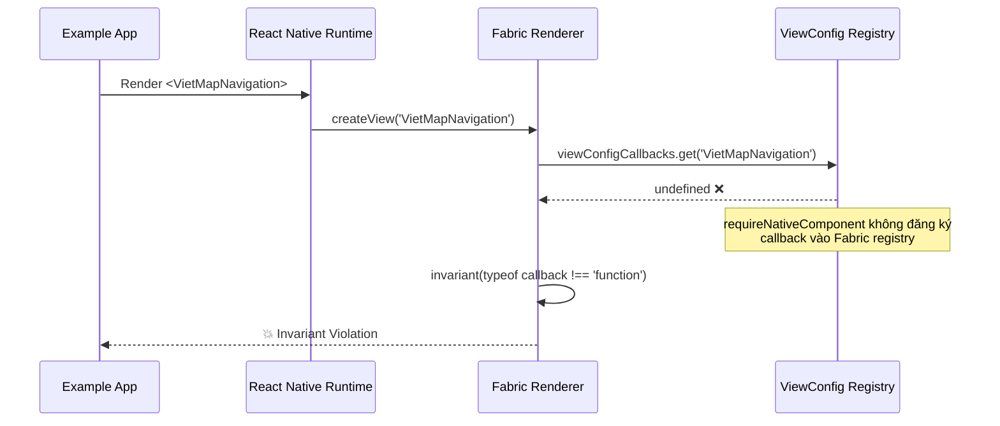

# Phân tích lỗi: `View config getter callback for component 'VietMapNavigation' must be a function (received undefined)`

## Tóm tắt nhanh

Lỗi xảy ra vì **có xung đột giữa hai cách đăng ký native component** trên JS side:

1. `requireNativeComponent('VietMapNavigation')` — cách cũ (Old Architecture / Bridge)
2. Codegen-generated `VietMapNavigationNativeComponent` — cách mới (New Architecture / Fabric)

Khi **New Architecture được bật mặc định** (RN 0.85.2), React Native tìm component qua **Fabric registry** trước. Nhưng cách JS code hiện tại dùng `requireNativeComponent` khiến Interop Layer không thể map đúng component, dẫn đến `viewConfigCallbacks.get('VietMapNavigation')` trả về `undefined`.

---

## Chi tiết phân tích

### 1. Hiện trạng code — Hai hệ thống xung đột

#### Phía JS (Old Arch style):

```
src/VietMapNavigationNativeComponent.ts (dòng 36-37)
```

```typescript
const RNVietMapNavigation: HostComponent<NativeProps> =
  requireNativeComponent<NativeProps>('VietMapNavigation');
```

→ Đây là cách đăng ký **Old Architecture** (Bridge). `requireNativeComponent` gọi vào `UIManager.getViewManagerConfig('VietMapNavigation')` để lấy view config.

#### Phía Android Native (New Arch style):

```
android/.../VietMapNavigationManager.kt (dòng 11-12, 20-22)
```

```kotlin
import com.facebook.react.viewmanagers.VietMapNavigationManagerDelegate
import com.facebook.react.viewmanagers.VietMapNavigationManagerInterface

private val delegate = VietMapNavigationManagerDelegate(this)
override fun getDelegate(): ViewManagerDelegate<VietMapNavigationView> = delegate
```

→ Android ViewManager đã được migrate sang **New Architecture pattern**: dùng `VietMapNavigationManagerDelegate` và `VietMapNavigationManagerInterface` — đây là code được **Codegen tự generate** từ `VietMapNavigationNativeComponent.ts`.

#### package.json — Codegen đã được kích hoạt:

```json
"codegenConfig": {
    "name": "VietMapNavigationSpec",
    "type": "components",
    "jsSrcsDir": "src",
    "android": {
      "javaPackageName": "vn.vietmap.vietmapnavigation"
    }
}
```

→ Codegen sẽ quét `src/` tìm file có tên `*NativeComponent.ts` và generate interface + delegate Java/Kotlin code. **Codegen đã chạy** (vì `VietMapNavigationManagerDelegate` import compile được).

### 2. Nguyên nhân gốc rễ

> [!CAUTION]
> **Xung đột giữa `requireNativeComponent` và Codegen Interop Layer**

Khi RN 0.85.2 + New Architecture enabled:

1. **Codegen** quét `src/VietMapNavigationNativeComponent.ts`, nhưng file này dùng `requireNativeComponent` thay vì `codegenNativeComponent`.
2. **Fabric renderer** cần component được đăng ký qua `codegenNativeComponent('VietMapNavigation')` để tạo **view config getter callback** đúng.
3. `requireNativeComponent` trả về component nhưng **không đăng ký view config callback** vào Fabric's `viewConfigCallbacks` map.
4. Khi React render `<VietMapNavigation>`, Fabric gọi `viewConfigCallbacks.get('VietMapNavigation')` → nhận `undefined` → **Invariant Violation**.

### 3. Tại sao Android native đã migrate nhưng JS chưa?

Nhìn vào codebase, có vẻ quá trình migration đã:

| Layer | Status | Chi tiết |
|-------|--------|----------|
| **Android Native** | ✅ Đã migrate sang New Arch | Dùng `ViewManagerDelegate`, `VietMapNavigationManagerInterface`, `UIManagerHelper` event dispatch |
| **iOS Native** | ❌ Chưa migrate | Vẫn dùng `RCTViewManager` + `RCT_EXTERN_MODULE` thuần túy (Old Arch) |
| **JS Component** | ❌ Chưa migrate | Vẫn dùng `requireNativeComponent` thay vì `codegenNativeComponent` |

→ **Android Native đã chuyển sang New Arch pattern nhưng JS side vẫn giữ Old Arch pattern** — tạo ra sự không nhất quán.

### 4. Luồng lỗi cụ thể



### 5. Lý do Interop Layer không cứu được

Theo tài liệu migration của bạn (mục 1):

> SDK này dùng **old/bridge architecture** hoàn toàn. Từ RN 0.76+, New Architecture được bật mặc định. SDK vẫn hoạt động thông qua **Interop Layer**.

Interop Layer **có thể** cho phép Old Arch components hoạt động trên New Arch, **nhưng chỉ khi**:
- JS side dùng `requireNativeComponent` **và** Native side **không** có codegen delegate.
- Hoặc JS side dùng `codegenNativeComponent` **và** Native side có codegen delegate.

Trường hợp hiện tại: **JS dùng `requireNativeComponent` nhưng Android Native đã dùng Codegen delegate** → Interop Layer bị confused, không biết map component theo cách nào.

---

## Hai hướng fix có thể

### Hướng A: Chuyển JS sang `codegenNativeComponent` (Khuyến nghị ✅)

Đổi [VietMapNavigationNativeComponent.ts](file:///Users/nguyentoan/App/map_sdk/react_native/vietmap-react-native-navigation/src/VietMapNavigationNativeComponent.ts) để dùng `codegenNativeComponent`:

```typescript
import codegenNativeComponent from 'react-native/Libraries/Utilities/codegenNativeComponent';
import type { ViewProps } from 'react-native';

// ... interface NativeProps extends ViewProps { ... }

export default codegenNativeComponent<NativeProps>('VietMapNavigation');
```

→ Đồng bộ với Android đã migrate. iOS sẽ tự hoạt động qua Interop Layer.

### Hướng B: Rollback Android về Old Arch (Tạm thời)

Xóa `VietMapNavigationManagerDelegate` + `VietMapNavigationManagerInterface` khỏi [VietMapNavigationManager.kt](file:///Users/nguyentoan/App/map_sdk/react_native/vietmap-react-native-navigation/android/src/main/java/vn/vietmap/vietmapnavigation/VietMapNavigationManager.kt), quay lại `SimpleViewManager` thuần túy.

→ Cả Android và iOS đều chạy qua Interop Layer.

---

## Kết luận

| Yếu tố | Chi tiết |
|---------|---------|
| **Root cause** | `requireNativeComponent` (JS) xung đột với Codegen Delegate (Android Native) khi New Arch enabled |
| **Tại sao chỉ xảy ra sau migration** | RN 0.85.2 bật New Arch mặc định + Android native đã được migrate sang Codegen pattern |
| **Platform bị ảnh hưởng** | Cả iOS và Android (lỗi ở JS layer, trước khi chạm native) |
| **Fix chính** | Đổi `requireNativeComponent` → `codegenNativeComponent` trong `VietMapNavigationNativeComponent.ts` |
